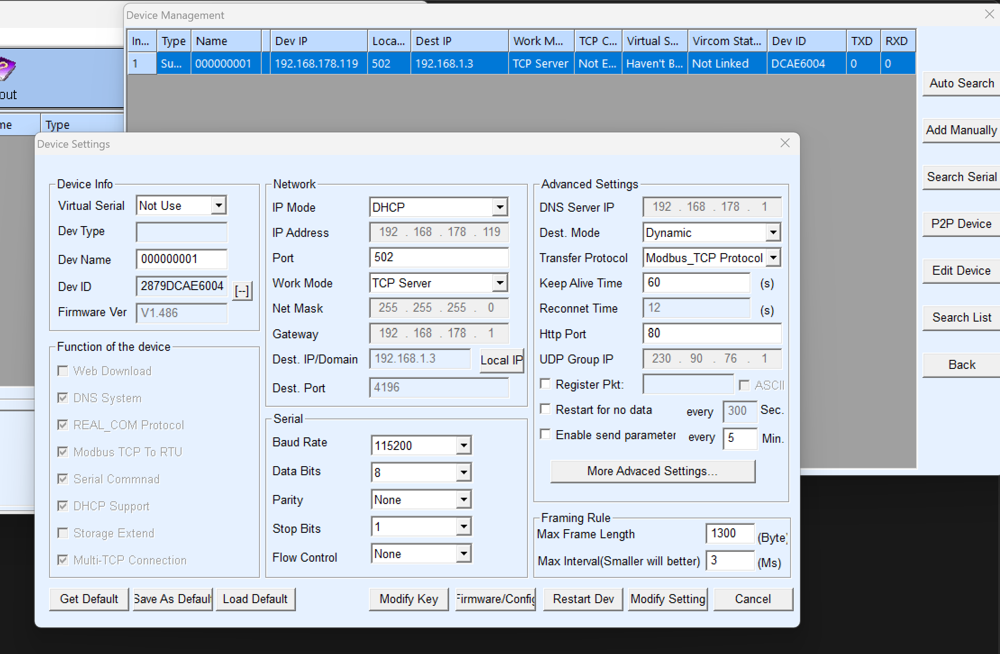
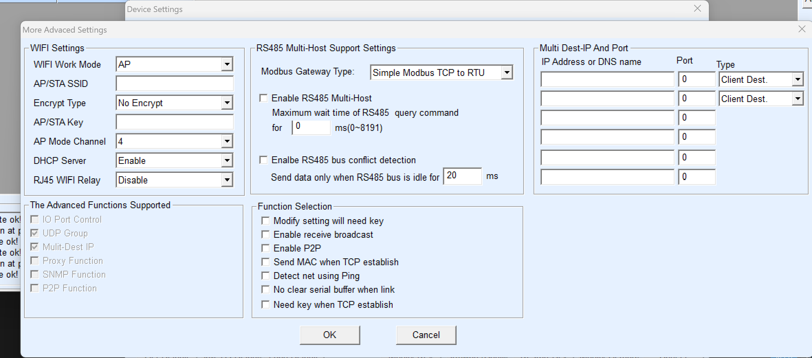

# Waveshare Relay Home Assistant Integration

This is a custom integration for Home Assistant to control the Waveshare Modbus POE ETH Relay Board. It allows you to control relay channels and configure flash intervals directly from Home Assistant.

## Features

- Control relay channels on the Waveshare Relay Board.
- Configure flash intervals using an input number entity.
- Easy setup through Home Assistant's configuration flow.
- Compatible with HACS for easy installation and updates.

## Installation

### Prerequisites

- Home Assistant (version 2024.11.0 or later)
- A configured Waveshare Relay Board on your local network

### Steps

1. **Device Configuration:**

   - Install the configuration software called Vircom from: https://www.waveshare.com/wiki/Modbus_POE_ETH_Relay_30CH#Software_Installation
 
   - Start the Vircom configuration software and connect to device.

   - **Enable DHCP (Optional):** You can enable DHCP for automatic IP address assignment if supported by your network.
   - **Transfer Protocol:** Ensure the transfer protocol is set to `Modbus_TCP_Protocol`.
   - **Advanced Settings:** Set the Modbus Gateway Type to `Simple modbus TCP to RTU` for proper communication.

   Below are some screenshots to help you configure the Waveshare Relay:

   - **Basic Configuration:**

     

   - **Advanced Configuration:**

     

2. **Add Custom Repository in HACS:**

   - Go to HACS in Home Assistant.
   - Click on the "Integrations" tab.
   - Click on the three dots in the top right corner and select "Custom repositories".
   - Add the URL of this repository: `https://github.com/sebastianfs82/HomeAssistant-Waveshare-Relay`.
   - Select "Integration" as the category.

3. **Install the Integration:**

   - After adding the repository, find "Waveshare Relay" in the HACS store under Integrations.
   - Click "Install" to add it to your Home Assistant setup.

4. **Configure the Integration:**

   - Go to Home Assistant Configuration.
   - Click on "Devices & Services".
   - Click "Add Integration" and search for "Waveshare Relay".
   - Follow the setup wizard to enter the IP address and port of your Waveshare Relay Board.
   - Optionally, enter a custom name for the device to easily identify it.
   - Optionally, enter the amount of relay channels your device has; the default is 8.

## Troubleshooting

- Ensure the IP address of the relay board is correct.
- Check the Home Assistant logs for any error messages related to the integration.

## Contributing

Feel free to open issues or submit pull requests to improve the integration.

## License

This project is licensed under the MIT License.

## Acknowledgments

- Thanks to the Home Assistant community for their support and contributions.
